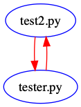

# PyDepends
Python3 project to plot file dependency graphs and detect external module dependencies to write into ```requirements.txt``` automatically

## Dependencies
- The dependencies are only for graph visualization
- Install dependencies using:
```
  pip install -r requirements.txt
```
- Use either ```pygraphviz``` or ```networkx``` to visualize graph, see ```visualizer/visualizer.py``` for detailed instructions
## Graph Visualization
- For the entire project directory:


- For SubGraph:



## Usage
- ```python3 main.py -h``` to see argument usage 
- ```python3 main.py -mr={module_root}``` to specify module root to inspect
- ```python3 main.py -af``` to inspect all files aside from ```.py``` files
- ```python3 main.py -ic={ignoreConfig}``` to specify which config file to read ignore files from
- ```python3 main.py -vb``` to print verbosely when finding dependencies
- ```python3 main.py -gp``` to specify graph path
- ```python3 main.py -vg``` to specify whether to show graph

## Constraints
- ```MGC.printModule(show_graph=True)``` and ```SubGraph``` utility is available only when either ```pygraphviz``` or ```networkx``` is installed 

## Outputs
- Output png file as ```{args.graphpath}.png```
- Output dot file as ```{args.graphpath}.dot```

## File Structure
- This is print out by the program itself

.....File Structure.....
```
/.
	/test_module
		tester.py
		__init__.py
		test2.py
	/MGC
		moduleClasses.py
		__init__.py
		SubGraph.py
	/utils
		util.py
		__init__.py
	/FGC
		moduleNode.py
		__init__.py
		fileGraphConstructor.py
	/visualizer
		__init__.py
		visualizer.py
	pgv2nx.py
	main.py
```

File: ./pgv2nx.py
Constructing definitions in file: ./pgv2nx.py

	All modules:
		networkx
		matplotlib.pyplot

	Externals:
		networkx
		matplotlib
	No depend files
	No class definitions
	No function definitions

File: ./main.py
Constructing definitions in file: ./main.py

	All modules:
		argparse
		FGC.fileGraphConstructor
		MGC
		FGC.moduleNode

	Externals:
		argparse
	Depend Files:
		fileGraphConstructor.py
		moduleNode.py
	No class definitions
	Functions:
		main

File: ./test_module/tester.py
Constructing definitions in file: ./test_module/tester.py

	All modules:
		test_module.test2

	No external dependencies
	Depend Files:
		test2.py
	No class definitions
	Functions:
		test_func

File: ./test_module/__init__.py
Constructing definitions in file: ./test_module/__init__.py

	All modules:
		test_module
		.
	No external dependencies
	Depend Files:
		test2.py
		tester.py
	Classes:
		test_init
	No function definitions

File: ./test_module/test2.py
Constructing definitions in file: ./test_module/test2.py

	All modules:
		test_module.tester

	No external dependencies
	Depend Files:
		tester.py
	Classes:
		test2
	No function definitions

File: ./MGC/moduleClasses.py
Constructing definitions in file: ./MGC/moduleClasses.py

	All modules:

	No external dependencies
	No depend files
	Classes:
		File
		Directory
	Functions:
		File/__init__
		File/__repr__
		File/print_dependencies
		File/print_externals
		File/print_classes
		File/print_functions
		File/customType
		Directory/__init__
		Directory/__repr__
		Directory/customType
		Directory/addChildDir
		Directory/addChildFile

File: ./MGC/__init__.py
Constructing definitions in file: ./MGC/__init__.py

	All modules:
		os
		moduleClasses
		FGC.fileGraphConstructor
		visualizer.visualizer
		re
		utils.util
		FGC.moduleNode
		sys
		imp
		SubGraph

	Externals:
		os
		sys
		imp
		re
	Depend Files:
		visualizer.py
		SubGraph.py
		util.py
		moduleNode.py
		moduleClasses.py
		fileGraphConstructor.py
	Classes:
		ModuleGraphConstructor
	Functions:
		ModuleGraphConstructor/__init__
		ModuleGraphConstructor/constructFileNode
		ModuleGraphConstructor/constructDirNode
		ModuleGraphConstructor/traverse_module
		ModuleGraphConstructor/traverseDirUp
		ModuleGraphConstructor/cleanDir
		ModuleGraphConstructor/printModule
		ModuleGraphConstructor/traversePrint
		ModuleGraphConstructor/parseFGC
		ModuleGraphConstructor/constructDefs
		ModuleGraphConstructor/resolvePCD
		ModuleGraphConstructor/findDepends
		ModuleGraphConstructor/writeRequirements
		process

File: ./MGC/SubGraph.py
Constructing definitions in file: ./MGC/SubGraph.py

	All modules:
		visualizer.visualizer

	No external dependencies
	Depend Files:
		visualizer.py
	No class definitions
	Functions:
		dep_resolve
		SubGraph

File: ./utils/util.py
Constructing definitions in file: ./utils/util.py

	All modules:

	No external dependencies
	No depend files
	No class definitions
	Functions:
		print_tabs

File: ./utils/__init__.py
Constructing definitions in file: ./utils/__init__.py

	All modules:

	No external dependencies
	No depend files
	No class definitions
	No function definitions

File: ./FGC/moduleNode.py
Constructing definitions in file: ./FGC/moduleNode.py

	All modules:
		utils.util

	No external dependencies
	Depend Files:
		util.py
	Classes:
		ObjectNode
		ModuleNode
	Functions:
		ObjectNode/__init__
		ObjectNode/__repr__
		ObjectNode/addDependency
		ObjectNode/print
		ModuleNode/__init__
		ModuleNode/addDependency
		ModuleNode/addObjects
		ModuleNode/printDependencies
		ModuleNode/printObjects
		ModuleNode/print

File: ./FGC/__init__.py
Constructing definitions in file: ./FGC/__init__.py

	All modules:

	No external dependencies
	No depend files
	No class definitions
	No function definitions

File: ./FGC/fileGraphConstructor.py
Constructing definitions in file: ./FGC/fileGraphConstructor.py

	All modules:
		ast
		FGC.moduleNode

	Externals:
		ast
	Depend Files:
		moduleNode.py
	Classes:
		FileGraphConstructor
	Functions:
		FileGraphConstructor/__init__
		FileGraphConstructor/readFile
		FileGraphConstructor/visitTree
		FileGraphConstructor/visit_Import
		FileGraphConstructor/visit_ImportFrom
		FileGraphConstructor/visit_ClassDef
		FileGraphConstructor/visit_FunctionDef
		FileGraphConstructor/print_nodes

File: ./visualizer/__init__.py
Constructing definitions in file: ./visualizer/__init__.py

	All modules:

	No external dependencies
	No depend files
	No class definitions
	No function definitions

File: ./visualizer/visualizer.py
Constructing definitions in file: ./visualizer/visualizer.py

	All modules:
		pygraphviz
		networkx
		matplotlib.pyplot

	Externals:
		networkx
		pygraphviz
		matplotlib
	No depend files
	Classes:
		graphVisualizer
	Functions:
		graphVisualizer/__init__
		graphVisualizer/add_node
		graphVisualizer/add_edge
		graphVisualizer/addFile
		graphVisualizer/addDir
		graphVisualizer/addDependencies
		graphVisualizer/addExternals
		graphVisualizer/showGraph
		graphVisualizer/showGraphPGV
		graphVisualizer/showGraphNX
		
......All external dependencies......

sys
ast
argparse
matplotlib
os
networkx
imp
pygraphviz
re


.....External dependencies that are installed.....
```
	 networkx
	 pygraphviz
	 matplotlib
```
.....External dependencies that are not installed.....

.....Built in dependencies.....
```
	 sys
	 ast
	 argparse
	 os
	 imp
	 re
```

